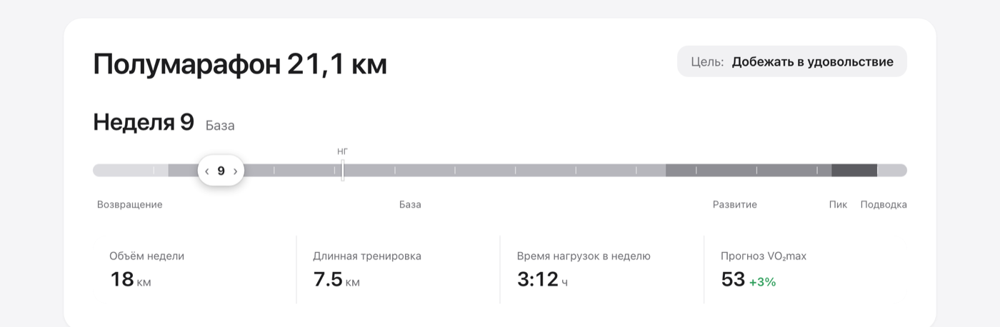
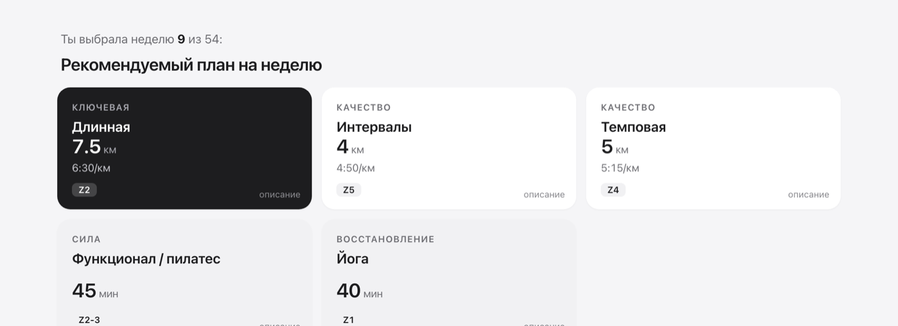
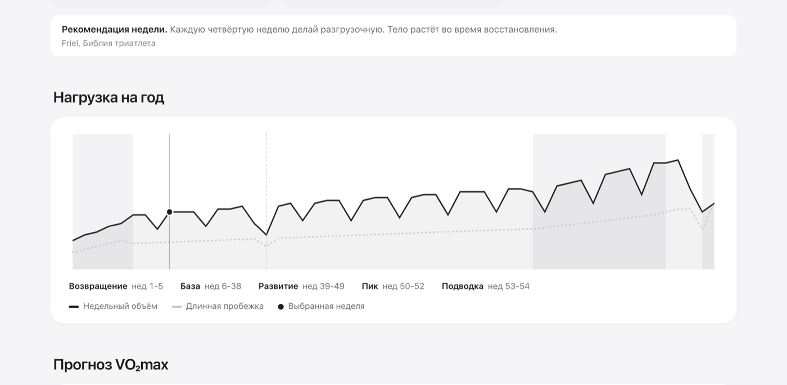
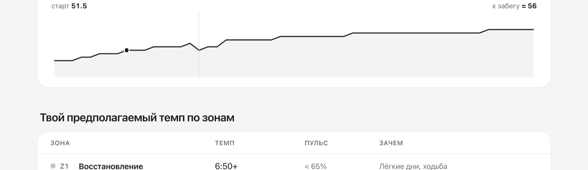
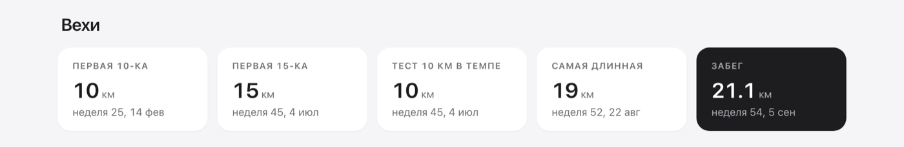
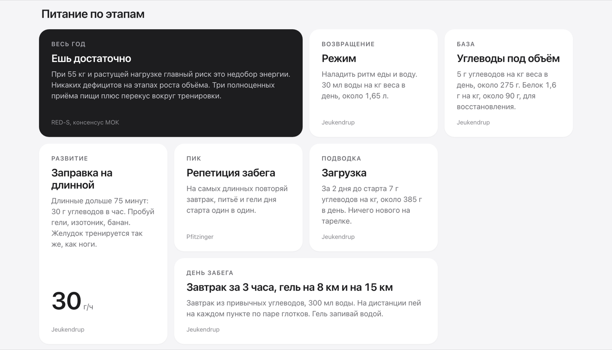

# marathon

Claude-скилл, который собирает персональный годовой план подготовки к полумарафону или марафону **в ритме жизни нормального человека**. План вписывается в работу, поездки, праздники, любимые тренировки и плохие недели, и при этом стоит на проверенной методике.

Говоришь Claude «собери план к полумарафону», отвечаешь на вопросы по одному, получаешь файл плана и вот такую страницу.



## Как это работает

1. **Интейк в чате.** Двенадцать вопросов по одному: цель, дистанция, где ты сейчас в беге, VO₂max, какие тренировки уже в жизни и сколько идут, сколько дней в неделю, здоровье, питание, когда точно выпадаешь.
2. **Расчёт на методике.** Периодизация Friel и Pfitzinger, зоны по Daniels (VDOT), распределение 80/20, сила по Blagrove, питание по Jeukendrup и RED-S. Все числа лежат в `references/methodology.md`, модель ничего не выдумывает.
3. **Файл человека.** Markdown с YAML-шапкой в приватном локальном репо `~/Documents/marathon-plans/`. Это источник правды.
4. **Артефакт.** HTML-страница из `assets/plan-template.html`: скилл заполняет один блок `PLAN`, разметку не трогает.

## Что внутри плана

Тянешь ползунок по году, всё ниже пересчитывается. Карточки тренировок переворачиваются: на обороте, как выполнять.



Нагрузка на год и прогноз VO₂max.



Темпы по зонам под твой VO₂max с поправкой на гаджет.



Вехи по датам и что мониторить, чтобы понимать, что план работает.




Питание по этапам, цифры на вес.



И главное для жизни: что делать, когда сбилась. Пропуски, болезнь, жёлтый и красный рекавери, мало времени, боль, переезды.


## Живой план

Скилл умеет пересобирать план без повторного интейка: «выпала на две недели», «в марте переезжаю», «на этой неделе только два раза». Правила возврата после пауз тоже из методики.

## Структура

```
marathon/
├── SKILL.md                  инструкция для Claude
├── references/
│   ├── intake.md             вопросы и ветвления
│   ├── methodology.md        числа из источников
│   ├── setup.md              приватный репо планов
│   └── feedback.md           правки по ходу использования
├── assets/
│   ├── plan-template.md      файл человека
│   └── plan-template.html    страница плана
└── docs/                     дизайн, макет, скриншоты
```

## Установка

Скопируй папку в `~/.claude/skills/marathon` и скажи Claude Code: «собери план к забегу».

## Принципы

- Начинаем с минимума, дорабатываем по реальному опыту. Правки копятся в `references/feedback.md`.
- Планы личные, репо планов локальный, наружу ничего не уходит.
- Это не медицина. При травмах и диагнозах к врачу.
